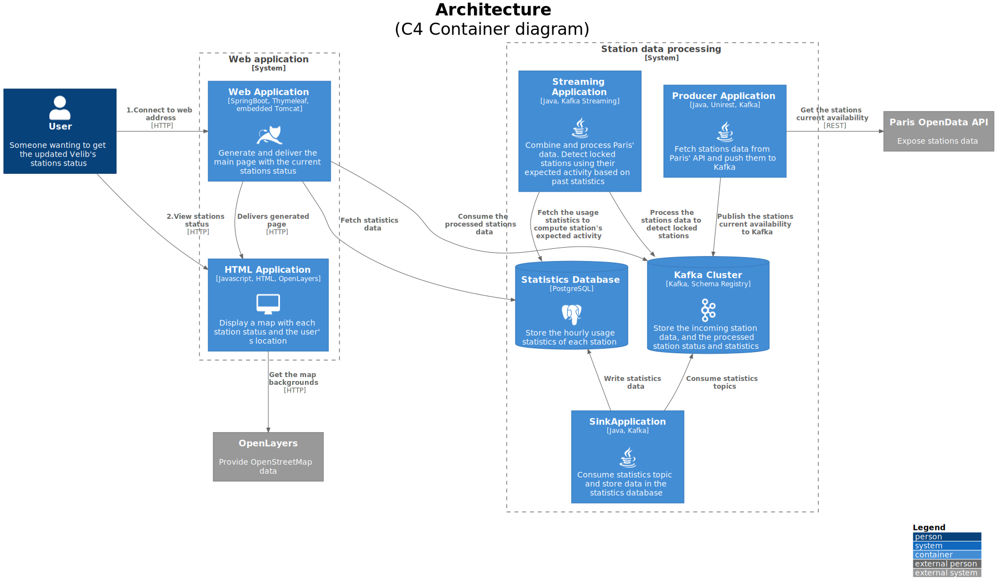
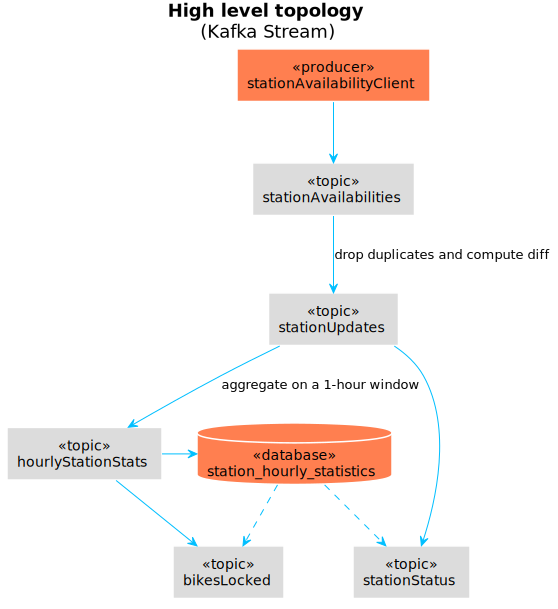

# Velinfo - Kafka Prototype

A prototype for a java project using Kafka to process the Paris' Velib (bicycles) stations, detect if they are locked, and diplay them using OpenLayers. 

Velib official station status is lacking and often does not report stations or slots that can be locked for several hours. This application try to estimate those.

## High level architecture

Using the Paris' [OpenData API](https://opendata.paris.fr/) as its source, a Kafka pipeline compute each Velib station status (locked bikes/slots/stations).
The aggregated data is consumed and exposed using a Spring Boot web application, serving a simple web page displaying the station (and their data) on a map using OpenLayers.

The dataset used is [velib-disponibilite-en-temps-reel](https://opendata.paris.fr/explore/dataset/velib-disponibilite-en-temps-reel) : the current (near real time) status of each station (available bicycles of each type, status of the station, geo-coordinates)

## Kafka topology

One of the goal of this project is to have fun with Kafka (and Kafka Streams). But the dataset used is not a stream of events, it's the current state of each station. So the first step is to generate a stream of "updates" from the difference between two subsequent states.

To estimate each station status (i.e. if it's locked), station statistics are computed with a one hour window. Thoses statistics are sunk into a dedicated database and used to compare the usage (or lack of) of a station for the past hours to its usual usage.

## Structure
* docs : resources for documentation (schemas, ...)
* run : docker compose file to setup the local env
* source : java application

## Prerequisites

* Docker for setting up the local env
* Java SDK (>=11) to run the application
* Maven for the dependencies management

## Running

TODO

## License

This project is licensed under the MIT License - see the [LICENSE.md](LICENSE.md) file for details

## Acknowledgments

* This project was inspired by Udacity's Datastreaming course.
* Thanks opendata.paris.fr for the data
